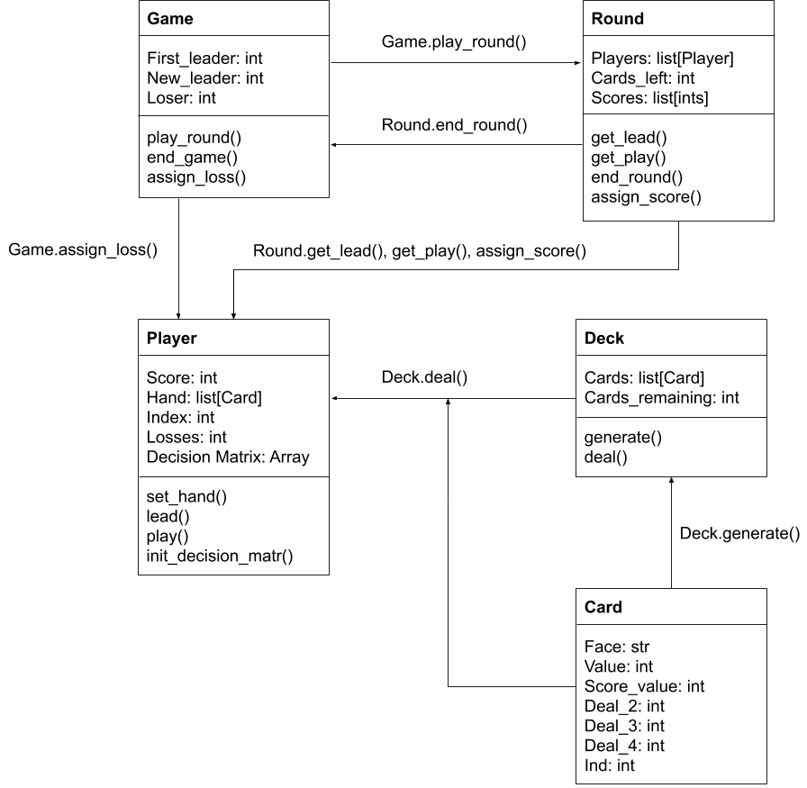

# 22_rl: Creating a framework for agents to play the game in an autonomous way. 

## First, let's establish some terminology. 

- **Game**: a complete instance of the game of 22. All players start with 0 score and sufficient hands and rounds are played for one player to accumulate a score greater than or equal to 22. 

- **Round**: an instance unit of multiple hands that results in a single player accumulating some points. A round is simply however many hands are required to get to the last card in all players hands (at the same time) such that points can be "awarded" to the loser. 

- **Hand**: the smallest unit of the game in which all players perform an action. The "leader" starts the hand by playing one or more cards and then all of the players in the game must respond once by playing the same number of cards. *Not to be confused with a player's hand, or the collection of cards the player holds at any given time. This nomenclature can be confusing, but this convention is used in most Western card games, so hopefully it is easy to understand.*

- **Leader**: the player who starts the hand. At the beginning of a game or a round, the leader is the player who sits to the right of the dealer. At the beginning of every hand after the opening hand of a round or game, the leader is the player who played the highest card or cards in the previous hand. However, in the context of this project, there is no dealer and there is concept for "right of". A sufficient definition in this context is the leader is player_1 at the start of each game as the definition of player_1 is the player who leads. 

- **Lead**: the play that the leader makes to start the game. The leader can play a single card or they can play multiple cards of the same value. 

- **Play**: once the leader has made their lead, all the remaining players must respond in order. A player must play the same number of cards as in the lead such that all players always have the same number of cards in their hand at the end of every hand. 

- **Play Under**: the strategic move to purposefully "burn" your lowest card or cards in order to save cards in your hand for successive hands in the game. 

- **Loss**: a player has lost the game when they have accumulated a score greater than or equal to 22. 

- **Win**: there is no concept of a win that is relevant to the card game 22 or 22_rl, this project. 

## Second, let's establish the rules. 

The full rules of the game can be found here: https://www.pagat.com/last/22.html

However, the initial version of 22_rl will be playing a simplified version of the game: 
- There will be no dealback, the chance for players to exchange cards in their hand that they do not like at the beginning of the round. 
- There will be no "play-off". In the event of a tie, tying agents' scores will be incremented by the tying value floor divided by the number of tying agents. For example, two agents tying with a nine will each get four points in their score, three agents tying with a seven will each get two points. 
- There will be no "four of a kind" leads. This is unfortunate, because they can be an exciting part of the game, but incorprating four of a kind leads and four-card responses to those leads increases the already-large problem space by a factor of 100. This makes the agent decision matrix far too large to retain meaning. I felt that this was a necessary and minimally invasive compromise because the probability of being dealt a four of a kind in a seven card hand is 0.0017, less than two tenths of a percent. Intuitively this makes sense as well. It is not productive to try to plan for a four of kind, or even in most cases a three of a kind, because of the unerlying rarity of having one of these in your hand as well as the likelihood of having the lead at a time that it is optimal to lead these cards. On the rare occasions that someone leads a four of a kind, it is best to just chalk whatever happens up to luck and move on. Removing these from the game allows a reinforcement learner to play the game in a way that mostly resembles the traditional game. This will be discussed in more depth later. 

## Third, let's establish the class design of the framework.

Here is a basic class layout showing how the various classes in the game interface with one another. This is not meant to be all-encompassing, but to just give a rough idea of what is happening under the hood during a game or series of games. 

[Post 3: Establishing this as a RL problem](https://github.com/zachsirera/22_rl/blob/main/posts/post_3.md)

